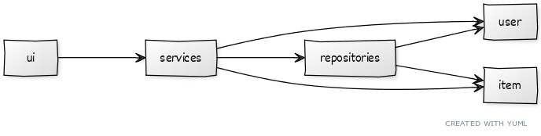
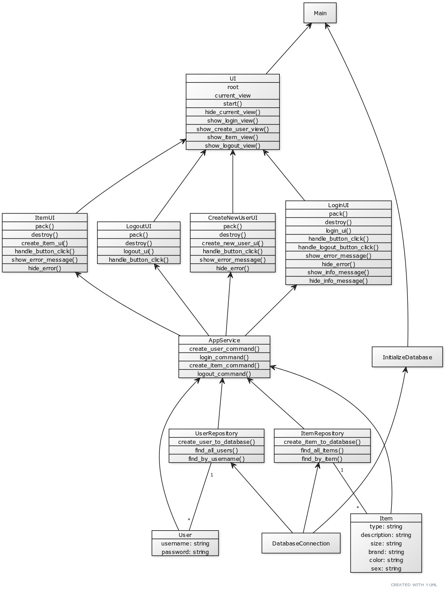
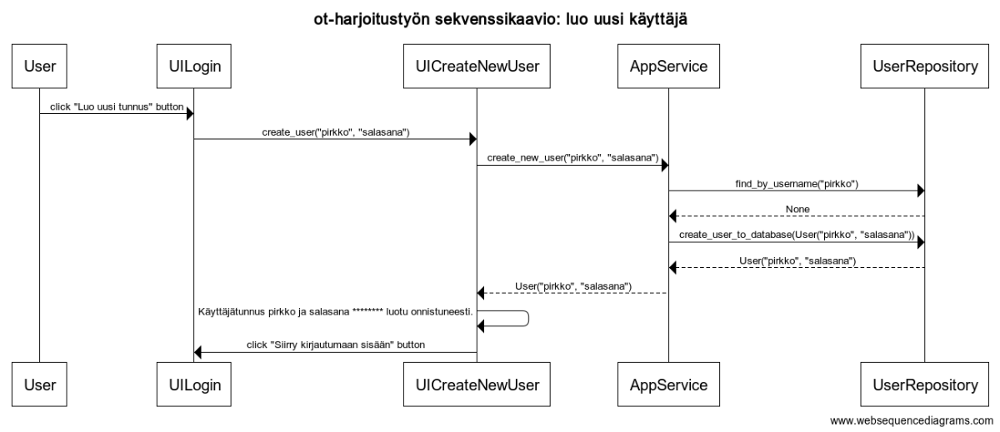
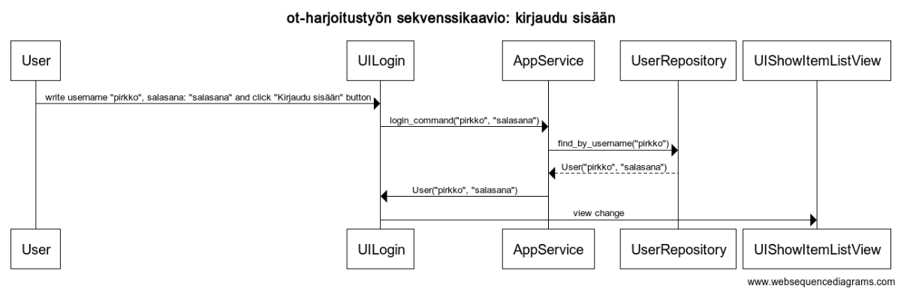

# Ohjelman arkkitehtuurikuvaus

## Ohjelman rakenne

Ohjelmassa on kolme tasoa:
* käyttöliittymätaso (ui) vastaa käyttöliittymälogiikasta ja käyttäjän syötteisiin reagoimisesta.
* palvelutaso (services) vastaa ohjelman sovelluslogiikasta ja toiminnoista.
* tietokantataso (repositories) vastaa datan tallennuksesta SQLite-tietokantaan.

Tämän lisäksi ohjelmassa on käyttäjäolio (user) ja tarvikeolio (item), jotka määrittävät käytettävät tiedot.
Ohjelman rakennetta esittävä kuvaus on esitetty alla.

## Käyttöliittymä

Käyttöliittymä on toteutettu Tkinterillä. Siinä on viisi eri näkymää:
* Luo uusi käyttäjätunnus ja salasana
* Kirjaudu sisään
* Tarvikelistasi
* Lisää tarvike
* Kirjauduit ulos

Jokainen näkymä on toteutettu omana luokkana, joiden välillä käyttäjä voi siirtyä näkymässä olevien painikkeiden avulla. Näkymien välittäjänä toimii ui-luokka, jolla ei ole omaa erillistä näkymää.

Tarvikelistasi-näkymässä käyttäjä voi valita tarviketyypit (vaate, kengät, muu tarvike), jotka haluaa nähdä. Käyttäjä näkee luonnollisesti vain omat (omaa käyttäjätunnusta vastaavat) tarvikkeensa.

## Palvelutaso eli sovelluslogiikka

Luokkakaavio esittää ohjelman yksityiskohtaisen sisällön (alla). Pääluokkien lisäksi siihen on sisällytetty muutama erillinen tärkeä metodi.

Kaaviosta voi nähdä, kuinka AppService-luokka asettuu käyttöliittymän ja tietokantatason väliin eriyttäen nämä toisistaan. Käyttäjä- ja tarviketieto (User ja Item) siirtyy käyttäjältä käyttöliittymän kautta ja palvelutason toimintojen avulla tietokantatasoon tallennettavaksi.

## Tietokantataso eli tietojen pysyväistalletus

Luokat UserRepository ja ItemRepository tallettavat, poistavat tai hakevat tietoja SQLite-tietokannasta.

Tietokanta alustetaan asennusohjeiden mukaisesti ennen ohjelman käynnistämistä.
Käyttäjä- ja tarviketiedoille luodaan omat taulukot (users ja items) tietokantaan alustamisen yhteydessä.

## Päätoiminnallisuudet

Ohjelman päätoiminnallisuuksiin kuuluu, että käyttäjä voi luoda uuden käyttäjätunnuksen ja salasanan
sekä sisäänkirjautuminen. Alla on näistä päätoiminnallisuuksista esitetty sekvenssikaaviot.

Kun käyttäjä luo uuden käyttäjätunnuksen, hän voi sisäänkirjautumisnäkymästä siirtyä "luo uusi tunnus" -näkymään.
Tässä näkymässä hän voi antaa uuden käyttäjätunnuksen ja salasanana (esim. "pirkko" ja "salasana").
Kun hän painaa painiketta "Luo uusi tunnus", käsky lähtee sovelluslogiikkakerroksen metodiin, josta
ensin lähtee tietokantatasolle kyselymetodi, että onko käyttäjätunnus jo olemassa. Jos käyttäjätunnusta
ei vielä ole, lähettää sovelluslogiikka käyttäjänluontipyynnön tietokantatasolle, joka tallettaa
käyttäjätunnuksen ja salasanan tietokantaan sekä palauttaa ne sovelluslogiikkatasolle, joka edelleen
palauttaa tiedot käyttäjätasolle, joka näyttää ruudulla tiedon, että käyttäjätunnus on luotu onnistuneesti.
Tämän jälkeen käyttäjä voi painaa sisäänkirjautumispainiketta ja siirtyä sisäänkirjautumisnäkymään.

Sisäänkirjautumisnäkymä toimii samankaltaisella logiikalla. Käyttäjä kirjoittaa käyttäjätunnuksen ja salasanan, jonka jälkeen hän painaa
"kirjaudu sisään" -painiketta. Tällöin metodi lähettää tiedot sovelluslogiikkatasolle, joka edelleen lähettää
tiedot tietokantatasolle. Jos käyttäjätunnus löytyy tietokannasta ja salasana vastaa käyttäjätunnuksen salasanaa,
tietokantataso palauttaa tiedot sovelluslogiikkatasolle, joka palauttaa ne käyttäjänäkymätasolle, jolloin
metodi päättyy siihen, että näkymä vaihtuu "Tarvikelistasi"-näkymään.

Mikäli käyttäjätunnus olisi jo olemassa tai salasana olisi väärin, käyttäjä saa tästä viestin käyttöliittymätasolla.

Muut toiminnallisuudet seuraavat samaa kaavaa, että käyttöliittymä on yhteydessä sovelluslogiikkatasolle,
joka on yhteydessä tietokantatasolle.

## Ohjelman rakenteeseen jääneet heikkoudet

Kun ohjelmasta poistaa valitun tarvikerivin, se poistaa useamman rivin, jos useammalla rivillä on täysin samat tiedot joka kohdassa.
