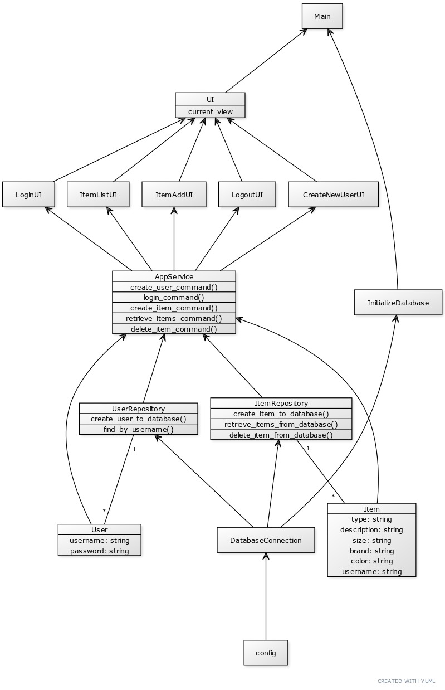

# Ohjelman arkkitehtuurikuvaus

## Ohjelman rakenne

Ohjelmassa on kolme tasoa:
* käyttöliittymätaso (ui) vastaa käyttöliittymälogiikasta ja käyttäjän syötteisiin reagoimisesta.
* palvelutaso (services) vastaa ohjelman sovelluslogiikasta ja toiminnoista.
* tietokantataso (repositories) vastaa datan tallennuksesta SQL-tietokantaan.

Tämän lisäksi ohjelmassa on käyttäjäolio (user) ja tarvikeolio (item), jotka määrittävät käytettävät tiedot.
Ohjelman rakennetta esittävä kuvaus on esitetty alla.

## Käyttöliittymä

Käyttöliittymä on toteutettu Tkinterillä. Siinä on viisi eri näkymää:
* Luo uusi käyttäjätunnus ja salasana
* Kirjaudu sisään
* Tarvikelistasi
* Lisää tarvike
* Kirjauduit ulos

Jokainen näkymä on toteutettu omana luokkana, joiden välillä käyttäjä voi siirtyä näkymässä olevien painikkeiden avulla.
Näkymien välittäjänä toimii ui-luokka, jolla ei ole omaa erillistä näkymää.

Tarvikelistasi-näkymässä käyttäjä voi valita tarviketyypit (vaate, kengät, tarvike), jotka haluaa nähdä. Käyttäjä näkee
luonnollisesti vain omat (omaa käyttäjätunnusta vastaavat) tarvikkeensa.

## Palvelutaso eli sovelluslogiikka

Luokkakaavio esittää ohjelman yksityiskohtaisen sisällön (alla).

Kaaviosta näkyy, kuinka Appservice-luokka asettuu käyttöliittymän ja tietokantatason väliin eriyttäen nämä toisistaan.
Käyttäjä- ja tarviketieto (User ja Item) siirtyy käyttäjältä käyttöliittymän kautta ja palvelutason toimintojen avulla
tietokantatasoon tallennettavaksi.

## Tietokantataso

* Harjoitustyön sekvenssikaavioita

## Päätoiminnallisuudet

TO BE ADDED

## Ohjelman rakenteeseen jääneet heikkoudet

Ohjelmasta ei voi vielä poistaa tarvikkeita.
