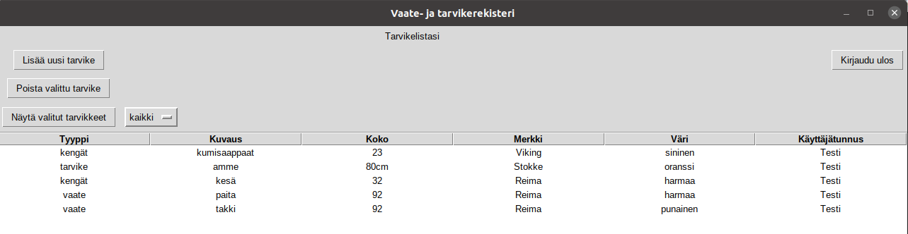
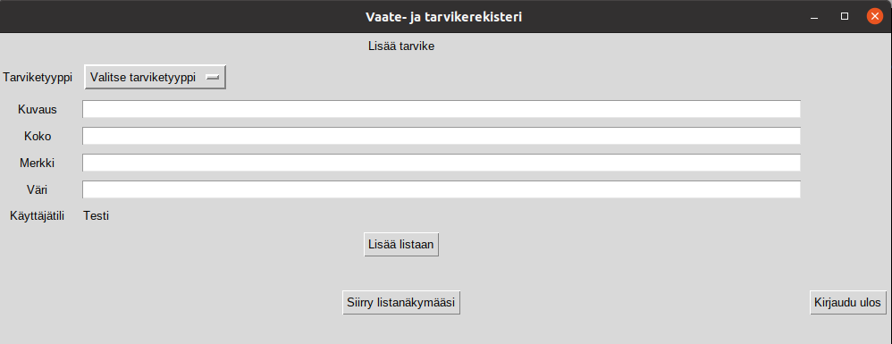

# Käyttöohje

## Yleistä
Ohjelmassa on viisi eri näkymää:
* Kirjaudu sisään
* Luo uusi käyttäjätunnus ja salasana
* Tarvikelistasi
* Lisää tarvike
* Kirjauduit ulos

Seuraavassa on kerrottu ohjeet jokaiselle eri näytölle.

## Kirjaudu sisään
Ohjelma käynnistyy ikkunaan, jossa käyttäjä voi kirjautua sisään tai siirtyä luomaan uutta tunnusta.

#### Käyttäjällä on tunnus
Mikäli käyttäjällä on olemassa oleva käyttäjätunnus ja salasana, hän kirjoittaa ne niille määrättyihin kenttiin, ja painaa
painiketta "Kirjaudu sisään". Tämän jälkeen käyttäjälle avautuu "Tarvikelistasi"-näkymä.

Jos käyttäjätunnusta ei löydy tai salasana ei vastaa käyttäjätunnukselle asetettua salasanaa, ruudulla näkyy tästä kertova
virheilmoitus, jonka jälkeen käyttäjä voi korjata tilanteen.

#### Käyttäjällä ei ole tunnusta
Mikäli käyttäjällä ei ole vielä käyttäjätunnusta, hän voi siirtyä "Luo uusi käyttäjätunnus ja salasana" -näkymään painamalla painiketta
"Luo uusi tunnus".

## Luo uusi käyttäjätunnus ja salasana

Käyttäjä voi tässä määrittää uuden käyttäjätunnuksen ja salasanan, ja painaa tämän jälkeen painiketta "Luo tunnus". Ohjelma
ilmoittaa, jos käyttäjätunnus on jo olemassa tai jos jompikumpi tietokenttä on tyhjä. Ohjelma ilmoittaa myös, jos käyttäjätunnus on
luotu onnistuneesti. Tämän jälkeen käyttäjä voi siirtyä kirjautumaan sisään painamalla painiketta "Siirry kirjautumaan sisään". 
Tämän jälkeen käyttäjä siirtyy takaisin "Kirjaudu sisään" -näkymään.

## Tarvikelistasi
Tässä näkymässä käyttäjä pääsee tarkastelemaan lisäämiään tarvikkeita.

Tarviketyyppejä on kolme (vaate, kengät, tarvike). Jos haluat, että listalla näkyy vain yksi tarviketyyppi, valitse haluamasi tyyppi
valikosta, jossa ensin lukee "kaikki". Tämän jälkeen paina painiketta "Näytä valitut tarvikkeet", jolloin lista päivittyy ja käyttäjä
näkee ainoastaan valitsemansa tarviketyypin mukaiset tarvikkeet.

Käyttäjä voi siirtyä lisäämään uusia tarvikkeita painikkeella "Lisää uusi tarvike". Tällöin hän siirtyy "Lisää tarvike" -näkymään.

Hän voi myös kirjautua ulos, jolloin hän siirtyy "Kirjauduit ulos" -näkymään.

## Lisää tarvike
Tässä näkymässä käyttäjä voi lisätä uuden tarvikkeen. Ensin tulee valita tarviketyyppi dropdown-valikosta, ja muut kentät voi 
täyttää vapaana tekstinä. Kun kaikki tiedot on lisätty, käyttäjä painaa "Lisää listaan", jolloin tarvike lisätään listalle, ja käyttäjä
näkee lisäämänsä tarvikkeen tiedot myös tässä näkymässä. Tällöin kentät tyhjenevät ja käyttäjä voi halutessaan lisätä toisen tarvikkeen.

Painamalla "Siirry listanäkymääsi" -painiketta, käyttäjä voi siirtyä "Tarvikelistasi"-näkymään tarkistelemaan sen hetkistä listaansa.

Hän voi myös kirjautua ulos, jolloin hän siirtyy "Kirjauduit ulos" -näkymään.

Vinkki: kannattaa kirjoittaa mahdollisimman yhtenäisesti, esim. värin perusmuodossa ja pienellä (ruskea, keltainen) tai kuvaus esim.
(ulkotakki, sisähousut). Voi olla, että myöhemmin tarvikkeita voi hakea näihin tietoihin perustuen.

## Kirjauduit ulos
Käyttäjä näkee, että hän on kirjautunut ulos palvelusta. Hän voi halutessaan kirjautua takaisin sisään painamalla "Siirry
sisäänkirjautumissivulle" -painiketta, jolloin hän siirtyy "Kirjaudu sisään" -näkymään.

