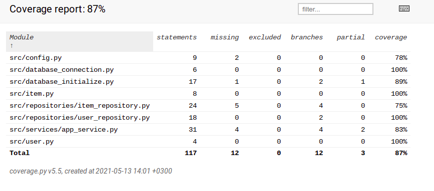

# Testausdokumentti

Ohjelman koodin toiminnallisuutta on testattu automatisoidun testityökalun avulla.
Testityökaluna on käytetty unittest-moduulia.

Ohjelmaa on myös testattu manuaalisesti käyttämällä ohjelmaa monipuolisesti.

## Automatisoidut testit (unittest)

Automatisoidut testit voidaan suorittaa komentoriviltä komennolla **poetry run invoke test** ja 
testauskattavuusraportin saa komennolla **poetry run coverage-report** (raportti ilmestyy htmlcov-kansioon).

Tähän liittyvät seuraavat tiedostot: pytest.ini, .env.test, .coverage, .coveragerc ja tests-kansion sisältämät tiedostot.
Testeillä on käytössä oma tietokanta. Käyttöliittymään liittyvää koodia ei ole sisällytetty automatisoituihin testeihin (määritetty .coveragerc-tiedostossa).

Sovelluslogiikka- ja tietokantatason testeillä on omat testitiedostot.

Tietokantatasolla testataan, että käyttäjätunnuksen ja tarviketietojen lisäys tietokantaan toimii oikein.
Testaus sisältää myös testejä, että tarvikelista näyttää oikeat tiedot valinnan mukaan.

Sovelluslogiikkatason testit testaavat, että käyttäjätunnuksen lisäys, sisäänkirjautuminen ja tarvikkeen lisäys- ja hakumetodit
toimivat oikein. Haettavat tiedot kulkevat tietokantatason kautta.

Ohjelman testauskattavuusraportti alla näyttää, että sovelluksen testauksen haarautumakattavuus on 87%.
Käyttöliittymätaso ei sisälly tähän testaukseen eikä index.py.

Tarvikkeen poistometodit ja erilaiset ValueError-osat ovat jääneet testauksen ulkopuolelle, mutta näitä
on testattu erityisen paljon manuaalisessa testauksessa.

## Manuaaliset testit

Ohjelmaa on testattu myös manuaalisesti Linux-ympäristössä. Sovelluksen Release-versio on ladattu
koneelle ja käytetty käyttöohjeen mukaisesti.

Kaikkia toiminnallisuuksia, painikkeita sekä oikeita ja vääriä syötteitä on testattu. Testauksen
perusteella ohjelma toimii hyvin.
