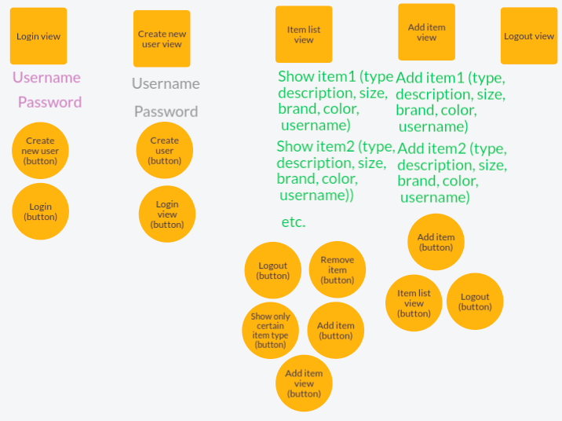

# Alustava määrittelydokumentti: Vaatimusmäärittely

## Sovelluksen tarkoitus

>  Lasten kanssa elämä on yhtä välineurheilua. 
>  Sovelluksen tarkoitus on helpottaa ja tehostaa tätä välineurheilua.

Sovellus on lastentarvikerekisteri. Sovelluksen avulla käyttäjä voi pitää kirjaa organisoidusti lasten vaatteista, kengistä ja muista tarvikkeista (amme, sukset jne.) ja niihin liittyvistä yksityiskohdista. 
Sovelluksen avulla käyttäjä näkee lasten vaatteisiin, kenkiin ja muihin tarvikkeisiin liittyvät tiedot helposti ja nopeasti.

## Sovelluksen käyttäjät

Sovelluksella on yksi käyttäjärooli, joka on *normaalikäyttäjä*. 

## Käyttöliittymäluonnos

Ohjelmassa on viisi näkymää: i) Kirjaudu sisään, ii) Luo uusi käyttäjätunnus ja salasana, 
iii) Tarvikelistasi, iv) Lisää tarvike ja v) Kirjauduit ulos. Näkymistä pääsee toisiin näkymiin painikkeilla  (pallot).

## Perusversion tarjoama toiminnallisuus

### Ennen kirjautumista

*Normaalikäyttäjä* voi kirjautua sisään omaan rekisteriinsä käyttäjätunnuksen ja salasanan avulla. Jos hänellä ei vielä ole käyttäjätunnuksia, hän voi mennä luomaan uuden käyttäjätunnuksen ja salasanan, jonka jälkeen hän voi kirjautua palveluun.

Toiminnallisuudet:
* Käyttäjä voi luoda uuden käyttäjätunnuksen ja salasanan.
* Käyttäjä voi kirjautua sisään.

### Kirjautumisen jälkeen

Kirjautumisen jälkeen *normaalikäyttäjälle* avautuu alue, jolla hän näkee aiemmin sivustolle lisäämänsä tarvikkeet sekä niihin liittyvät tiedot:
* tyyppi (vaate, kengät, muu tarvike)
* kuvaus (haalari, housut, paita jne.)
* koko (92, 25, 80cm)
* merkki (Reima, Stokke)
* väri (punainen, keltainen)
* oman käyttäjätunnuksen

Toiminnallisuudet:
* Käyttäjä näkee sivustolle lisäämänsä tarvikkeet listanäkymässä.
* Käyttäjä voi valita, mitkä tiedot listanäkymässä näkyy tarviketyypin mukaan eli lisätty perushakutoiminto.
* Käyttäjä voi poistaa valitsemansa rivin tiedot listanäkymästään ja rekisteristään.
* Käyttäjä voi lisätä uuden tarvikkeen (eli rivin tietoineen).
* Käyttäjä voi valita dropdown-valikon avulla, onko lisättävä tarvike vaate, kengät vai muu tarvike.
* Käyttäjä voi liikkua painikkeiden avulla näkymien välillä.
* Käyttäjä näkee vain oman listansa eli ohjelmalla voi olla useita käyttäjiä.
* Käyttäjä voi kirjautua ulos sovelluksesta.

## Toimintaympäristön rajoitteet

Sovellus toimii ainakin Linux-käyttöjärjestelmällä varustetussa tietokoneessa. Myös ainakin OS-käyttöjärjestelmällä sovellus on toiminut.
Kaikki sovelluksen tiedot talletetaan paikallisen koneen levylle.

## Jatkokehitysideoita ja muuta
1. Laajennetaan hakutoimintoa niin, että *normaalikäyttäjä* voi omasta rekisteristään etsiä tarvikkeita vapaatekstin avulla.
1. Kuvan lisäys jokaiselle tuotteelle/tarvikkeelle rekisteriin.
1. *Normaalikäyttäjä* voi merkitä, jos hän on lainannut joitain tarvikkeita joksikin aikaväliksi ja kenelle.
1. *Normaalikäyttäjä* voisi pitää kirjaa seuraavista hankinnoista eli mitä tulee hankkia ja milloin.
1. *Normaalikäyttäjä* voisi nähdä yhteenvetotaulukossa kuinka monta tarviketta hänellä on rekisterissä ja jaoteltuna vaatteisiin, kenkiin ja muihin tarvikkeisiin.
1. Voisi lisätä toisen käyttäjäroolin, joka olisi *vieraileva käyttäjä*. *Vieraileva käyttäjä* voisi luoda käyttäjätunnuksen ja päästä *normaalikäyttäjältä* saamaansa salasanaa vastaan katsomaan ja selaamaan kyseisen *normaalikäyttäjän* tietoja. *Vieraileva käyttäjä* voisi merkata omaan tauluunsa tarvikkeet, joista on kiinnostunut.
