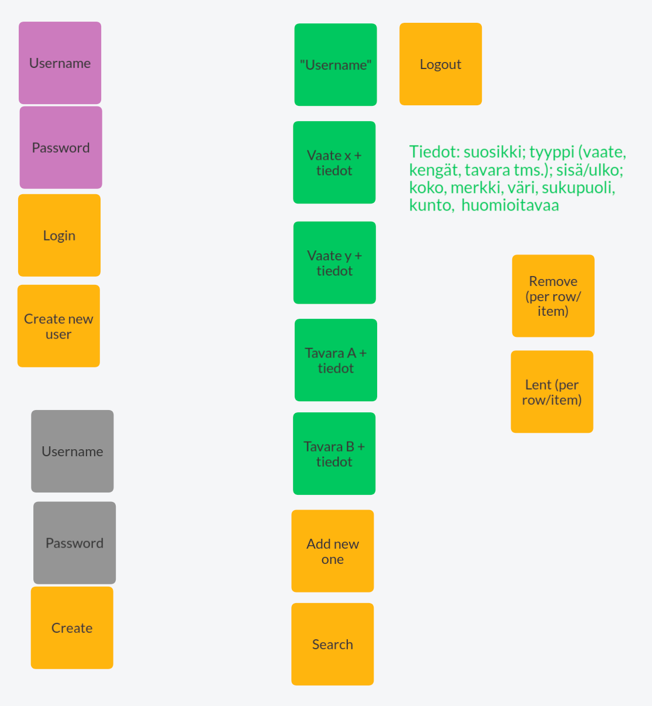

# Alustava määrittelydokumentti: Vaatimusmäärittely

## Sovelluksen tarkoitus

>  Lasten kanssa elämä on yhtä välineurheilua. 
>  Sovelluksen tarkoitus on helpottaa ja tehostaa tätä välineurheilua.

Sovellus on lastenvaate- ja tarvikerekisteri. Sovelluksen avulla käyttäjä voi pitää kirjaa organisoidusti lasten vaatteista, kengistä ja välineistä (esim. sukset) ja niihin liittyvistä yksityiskohdista. Sovelluksen avulla käyttäjä voi etsiä haluamaansa lasten vaatteisiin ja tarvikkeisiin liittyvää tietoa helposti ja nopeasti.

## Sovelluksen käyttäjät

Sovelluksella on ensi vaiheessa yksi käyttäjärooli, joka on *normaalikäyttäjä*. 

## Käyttöliittymäluonnos

Alussa on kolme näkymää: i) Kirjautumisnäkymä (vaaleanpunaiset laatikot), ii) käyttäjätunnuksen luontinäkymä (harmaan laatikot) sekä iii) vaate/tavaralistanäkymä (vihreät laatikot). Oranssit laatikot kuvastavat funktioita, joista kaikki eivät ole alussa mukana/käytössä.

## Perusversion tarjoama toiminnallisuus

### Ennen kirjautumista

*Normaalikäyttäjä* voi kirjautua sisään omaan rekisteriinsä käyttäjätunnuksen ja salasanan avulla. Jos hänellä ei vielä ole käyttäjätunnuksia, hän voi mennä luomaan uuden käyttäjätunnuksen ja salasanan, jonka jälkeen hän voi kirjautua palveluun.

### Kirjautumisen jälkeen

Kirjautumisen jälkeen *normaalikäyttäjälle* avautuu alue, jolla hän näkee aiemmin sivustolle lisäämänsä vaatteet ja tarvikkeet sekä niihin liittyvät lisätiedot, jotka sisältävät ainakin seuraavat tiedot:
* tyyppi (vaate, kengät, tavara...)
* koko
* merkki
* väri
* sukupuoli (T, P, unisex)
* pesty (kyllä, ei, n.a.)

Mahdollisesti myöhemmin laajennetaan vielä seuraavilla tiedoilla:
* suosikki (x, jos suosikki)
* sisä/ulko(käyttöön)
* kunto (kuin uusi, hyvä, tyydyttävä, rikki)
* kuva(jos mahdollista)
* huomioitavaa

Käyttäjä voi lisätä uuden vaatteen tai tarvikkeen (eli rivin tietoineen).
Käyttäjä voi kirjautua ulos (log out) sovelluksesta.

## Toimintaympäristön rajoitteet

Sovelluksen tulee toimia Linux-käyttöjärjestelmällä varustetussa tietokoneessa.
Kaikki sovelluksen tiedot talletetaan paikallisen koneen levylle.

## Jatkokehitysideoita ja muuta
1. Tehdään hakutoiminto (search), jonka avulla *normaalikäyttäjä* voi omasta rekisteristään etsiä vaatteita ja tavaroita tietyin parametrein (esim. koko).
1. Kuvan lisäys jokaiselle tuotteelle/tarvikkeelle rekisteriin.
2. Vaate/tarvike on mahdollista poistaa rekisteristä.
3. *Normaalikäyttäjä* voi merkitä, jos hän on lainannut joitain vaatteita tai tavaroita joksikin aikaväliksi ja kenelle.
4. *Normaalikäyttäjä* voisi pitää kirjaa seuraavista hankinnoista eli mitä tulee hankkia ja milloin.
5. *Normaalikäyttäjä* voisi nähdä yhteenvetotaulukossa kuinka monta vaatetta tai tarviketta hänellä on rekisterissä ja ehkä jaoteltuna tiettyihin osakokonaisuuksiin.
6. Voisi lisätä toisen käyttäjäroolin, joka olisi *vieraileva käyttäjä*. *Vieraileva käyttäjä* voisi luoda käyttäjätunnuksen ja päästä *normaalikäyttäjältä* saamaansa salasanaa vastaan katsomaan ja selaamaan kyseisen *normaalikäyttäjän* tietoja. *Vieraileva käyttäjä* voisi merkata omaan tauluunsa vaatteet ja tarvikkeet, joista on kiinnostunut.
7. Saatetaan laajentaa vielä esim. lasten huonekaluihin, rattaisiin jne.
